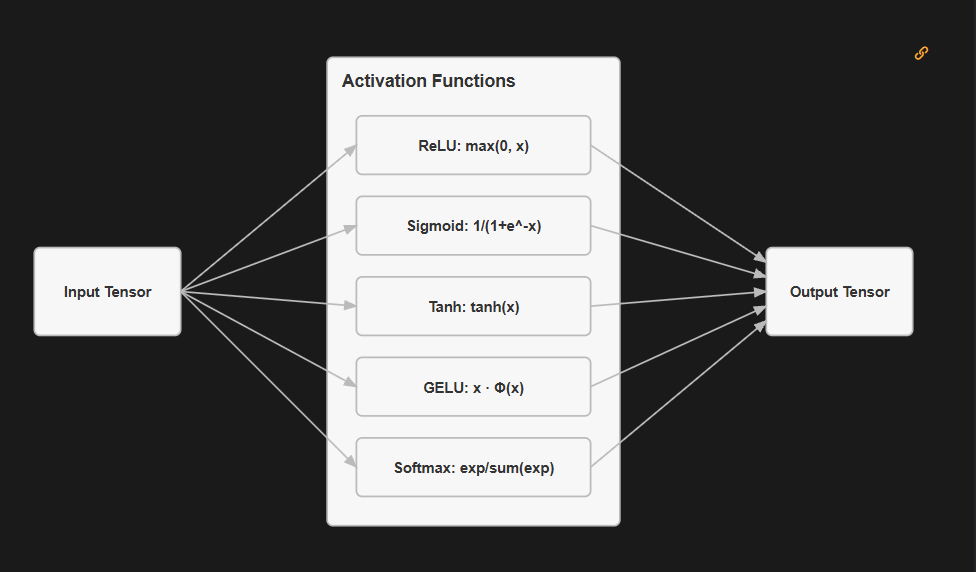

# Module 01 — Tensors

## Goal

Build a 5 activation layers such as: ReLU, Sigmoid, Tanh, GeLU and SoftMax

## Why it matters

Activation layers are a key component in DeepLearning model. Without it model would just get an input as a Tensor and return that Tensor with no transformations. Activation layers are the parts in that pipeline which help to make a predictions by transforming, changing the passed data.

Concept of activation layers and where they lie during a whole workflow:  



## Core concepts

1. ReLU.forward(): Sparsing data through zeroing negatives. Helps with feature selection and reduce computation time 
2. Sigmoid.forward(): Mapping to (0, 1) for probabilities 
3. Tanh.forward(): Hyperbolic tangent, zero-centered activation for better gradients
4. GELU.forward(): Smooth non-linearity for transformers
5. Softmax.forward(): Probability distributions with numerical stability

## Mathematics and rules

1. ReLU (Rectified Linear Unit) - replace the negatives with 0, math formula being: 

$$ f(x) = \max(0, x) $$

2.


# Yet to be written

## What I implemented

1. Class: Tensor
2. Methods
3. Supported oprations

## Experiment

All of the experiments are included in a experiment.ipynb file inside of the 01_tensors

1. Checking matrix multiplication with various arrays and some fail which is expected.
2. Comparing my class performance against PyTorch's matmul -> it was faster than mine, used 100x faster time for computation

Comparion results:

```
   Custom: 0.35976630001096055
   NumPy: 0.00021169998217374086
```

## What I learned

Tensors are fundamental and most used datastructures in DeepLearning and Model training, which helps with computing much faster with the help of library PyTorch

## Difficulties and open questions

Nothing. Everything was super simple, especially because I was moving slowly but understanding a topic

## Resources

NumPy: Array Programming - Harris et al. (2020). The definitive reference for NumPy, which underlies your Tensor implementation. Explains broadcasting, views, and the design philosophy. Systems Implication: Standardized memory layouts (strides) and contiguous blocks allowed C-level operations to bypass the slow Python interpreter, maximizing memory bandwidth. [Nature](https://www.nature.com/articles/s41586-020-2649-2)

https://mlsysbook.ai/tinytorch/modules/01_tensor.html
