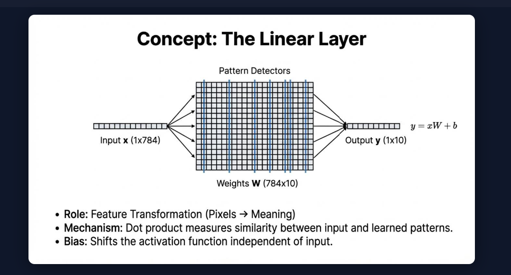

# Module 03 — Layers

## Goal

Is to build 3 Layers: Linear($y = xW + b$), Dropout and Sequential layers, so in the end it's possible to make `Sequential(Linear(784, 256), ReLU(), Linear(256, 10))`

Implement everything with methods of `forward()` and `parameters()`

## Why it matters

Layers are what make the neural networks work, it adds to a model weights and makes predictions via activations layers.

## Core concepts

1. `Linear layer` applies $y = x*Weight + bias$ and outputs the result as a Tensor. Bias can be ignored if parameter bias set to False
2. `Dropout layer` is a regularization technique which turns off temporarily specific percentage of neurons in our neural network in order to prevent overfitting. Works only during training and all neurons are then turned back on during validation and test
3. `Sequential layer`

## Mathematics and rules

1. `Linear Layer`. For
* Weight initialization we use formula: 
$$ \sigma = \sqrt{\frac{1}{\text{InFeats}}} $$
This initialization known as a `LeCun initialization` - it shrinks a random variable proprtionally to how many inputs the layer has(Normal distribution)
* Bias initialized at 0 because there is no gain from randomizing it.



2. `Dropout Layer`. Formula of a scaling unit: 

$$ \text{scale} = \frac{1}{1-p} $$
Algorithm: 

```python
Edge Case Checks: 
    If not training or prob == DropoutMinProb -> return the same result with no transformation
    If prob == DropoutMaxProb -> return the all zeros Tensor with shape of X.data.shape

    else:
        1. keep_prob = 1 - prob
        2. maskout the values in X where p < keep_prob(fill them with true)
        3. create a mask_tensor -> as type float32
        4. scale = Tensor(np.array(1 / keep_prob))
        5. compute the output = X * mask_tensor * scale
        6. Return Output
```

3. `Sequencial Layer`.


---
# TODO

## What I implemented

1. Classes: ReLU, GeLU, Sigmoid, Tanh, Softmax each with the methods of forward and `__call__` and a placeholder for the method called `backward`

## Experiment

All of the experiments are included in the experiment.ipynb file inside of 02_activations.

Each activation is tested by feeding the same input into both my `_CP` implementation and the matching PyTorch layer, then comparing the outputs with `np.allclose`:

1. ReLU: checked that negatives are zeroed and positives pass through unchanged.
2. Sigmoid: matches `torch.nn.Sigmoid` within `atol=1e-5`.
3. Tanh: matches `torch.nn.Tanh` within `atol=1e-5`.
4. GeLU: my version uses the sigmoid approximation `x * sigmoid(1.702x)`, while PyTorch's `GELU()` is the exact erf-based version, so they are compared with a looser `atol=0.05`. The measured max absolute difference is about 0.02.
5. Softmax: matches `torch.nn.Softmax(dim=-1)` within `atol=1e-5`, and each row sums to 1.

All comparisons pass.

## What I learned

Activations - are fundamental blocks in Neural Networks, without them stacking a one neural network on top of another would just mean a one NN, which would not affect or change the data.

What I learnt:
1.  that `ReLU` is a activation layer that replaces negative numbers with 0, but have drawbacks for the data with all negatives then it changes everything into 0 and then gradient descent for backward propagation becomes 0. 
2.  `Sigmoid` outputs values between 0 and 1 making it good for transforming and representing raw values in a view of `probabilities`
3.  in `Softmax` we substract max from the intire Matrix in order to normalize the vector, so the huge numbers in exponents will not explode, for example: $\exp^{100}≈ 2.7 * 10^{43}$ hence it overflows to inf, then numerator and denominator -> inf resulting in $\frac{inf}{inf}= nan$

## When to use which? 

1. `LeCun initialization` - designed specifically for SELU and TanH activation functions.
2. `Xavier/Glorot initialization` - designed for Tanh and Sigmoid fucntions
3. `He/Kaiming initialization` - designed for ReLU or Leaky ReLU activations.

## Resources

https://proceedings.mlr.press/v15/glorot11a.html - Deep Sparse Rectifier Neural Networks
