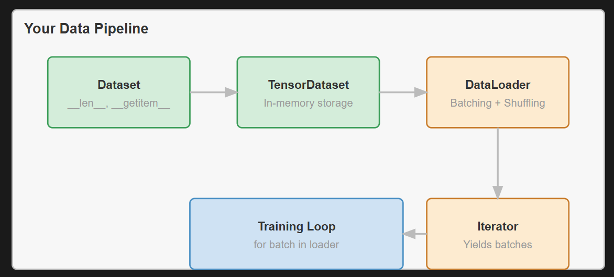

# Module 05 — Data Loader

## Goal

1. Implement a `Dataset abstraction` and `TensorDataset` for in-memory data storage
2. Build a `DataLoader` with intelligent batching, shuffling and memory-efficient iteration
3. Master python iterator protocol for streaming dataset without loading the entire dataset
4. Compare it with Pytorch's data loading patterns and see complexity issues

## Why it matters

`DataLoaders` help to load huge datasets efficiently by batching them. For example a ImageNet with 1.2M images would result in 600GB of RAM, this exceeds on almost any machine around the world. 



## Core concepts

1. `Dataset` - abstract base class, universal data access interface
2. `TensorDataset(Dataset)` - Tensor-based in-memory storage
3. `DataLoader.__init__()` - Store datasets, batch size, shuffle flag
4. `DataLoader.__iter__()` - Index shuffling and batch grouping
5. `DataLoader.__collate_batch()` - Stack samples into batch tensors

## Mathematics and rules

Pipeline to enable: 

```python 
dataset = TensorDataset(features, labels)
loader = DataLoader(dataset, batch_size=32, shuffle=True)

for batch_features, batch_labels in loader: 
    # batch_features: (32, features_dim) - ready for model.forward()
    predictions = model(batch_features)
```

## What I implemented

Classes: 
1. `Dataset` - For data abstraction
2. `TensorDataset` - For managing memory, and loading dataset into memery efficiently with giving data, only when requested
3. `DataLoader` - For distributing data into batches and efficiently iterating over the whole dataset

## Experiment

All experiments are included in [`experiment.ipynb`](experiment.ipynb). The notebook executes assertion-based checks for the complete module:

1. `TensorDataset`: aligned tensor storage, sample access, empty and single-tensor datasets, and invalid inputs.
2. `DataLoader`: full and partial batches, batch shapes, length, sequential order, shuffled feature-label alignment, once-per-epoch coverage, empty datasets, and argument validation.
3. `RandomHorizontalFlip`: deterministic `p=0` and `p=1` behavior, seeded randomness, HW/CHW/HWC layouts, container-type preservation, input safety, and validation.
4. `_pad_image` and `RandomCrop`: correct spatial shapes for HW/CHW/HWC data, zero borders, unchanged channel dimensions, reproducible crops, container-type preservation, and edge cases.
5. `Compose`: transform order, NumPy and `Tensor_CP` outputs, unchanged inputs, and invalid transform validation.
6. PyTorch parity: identical sequential batches from the same synthetic feature and label arrays.

The key correctness output from the executed notebook was:

```text
Batch sizes:            [4, 4, 3]
Maximum feature error: 0.0
Maximum label error:   0.0
PASS: TinyTorch and PyTorch produce identical sequential batches
```

### Efficiency results

The timer performs three warm-up epochs and reports the median of nine complete CPU epochs. Both loaders iterate over the same pre-created in-memory dataset of 4,096 `float32` samples with 32 features, using `batch_size=64`, no shuffling, and one process. The timed region includes iteration and collation, but excludes data creation, disk I/O, multiprocessing, and model computation.

| Input | TinyTorch | PyTorch | TinyTorch / PyTorch | TinyTorch throughput |
|---|---:|---:|---:|---|
| 4,096 samples x 32 features, 64 batches | `10.288 ms/epoch` | `20.606 ms/epoch` | `0.50x` | `398,122 samples/s` |

TinyTorch took about half as long as PyTorch for this small, single-process synthetic workload. This is not a general speed advantage: PyTorch's `DataLoader` supports substantially more functionality, and the result can change with dataset size, storage, transforms, worker count, CPU, library versions, and system load. The epoch checksums matched exactly, confirming that both timed loops consumed equivalent values.

All notebook assertions pass when executed top-to-bottom.

## What I learned

`Dataset` acts as a anonimization of a data, and `TensorDataset` - does loading and unloading from the memory, managing effiency
`DataLoader` - Does the batching and iteration on a memory level, and giving data only when requested.


## Resources

...