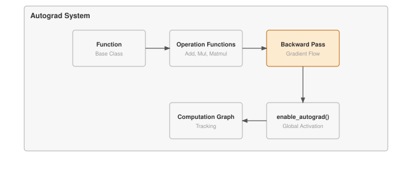

# Module 06 - Autograd

## Goal

1. Implement the `Function` base class that enables gradient computation for all operations. 
2. Build computation graphs that track dependencies between tensors during forward pass
3. `AddBackward, MulBackward, MatmulBackward` - operation specific gradient rules
4. `backward()` method on Tensor_CP reverse-mode differentiation
5. `enable_autograd()` enhancement 

## Why it matters

Every neural networks try to minimize the error causing loss parameters after each epoch, gradients are what give us the direction of the loss. And by using `Chain Rule` we can find those errors and minimize them. However, doing a chain rule by hand for a `Billion parameter model` is not only tedious, it's impossible. Hence, we utilize the trick called automatic differentiation.

## Core concepts



## Mathematics and rules


## What I implemented

Classes: 
1. `Cross Entropy and MSE`
2. `Log_softmax` - Overflow saving numerical stability technique used in classification.

## Experiment

All experiments are included in the `experiment.ipynb` file inside `06_autograd`.

Every backward rule and the `_sum_to_shape` helper is tested directly: a known `grad_output` is fed into `.apply(...)` and the returned gradients are asserted against the closed-form derivative of each operation. The checks cover numerical values (`np.allclose`, `atol=1e-6`), exact gradient shapes, `None` gradients for constants and `requires_grad=False` operands, broadcasting reduction, and every `axis`/`keepdims` combination for `Sum`/`Mean`.

A final end-to-end section drives the real `backward()` on `y = x * x` at `x = 3.0`: the first call gives `x.grad = 6.0`, a second call accumulates to `12.0`, `zero_grad()` on the leaf resets it to `None`, and the next `backward()` starts fresh at `6.0` again.

The summary from the executed notebook:

```text
component            | passed | failed |  status
----------------------------------------------------
_sum_to_shape        |      7 |      0 |  OK
AddBackward          |      4 |      0 |  OK
SubBackward          |      3 |      0 |  OK
MulBackward          |      4 |      0 |  OK
DivBackward          |      3 |      0 |  OK
MatMulBackward       |      4 |      0 |  OK
SumBackward          |      8 |      0 |  OK
MeanBackward         |      8 |      0 |  OK
ReshapeBackward      |      4 |      0 |  OK
TransposeBackward    |      3 |      0 |  OK
backward/zero_grad   |      4 |      0 |  OK
----------------------------------------------------
TOTAL                |     52 |      0 |

Overall: 52 passed, 0 failed out of 52 checks.
```

### Efficiency results

This module's notebook is correctness-only; no timing benchmark was run. Every backward rule is a vectorized NumPy expression (no Python loops over elements), and `backward()` visits each node once in topological order, so the cost of a backward pass stays proportional to the cost of the forward pass.

All 52 correctness checks pass.

## What I learned

## Resources